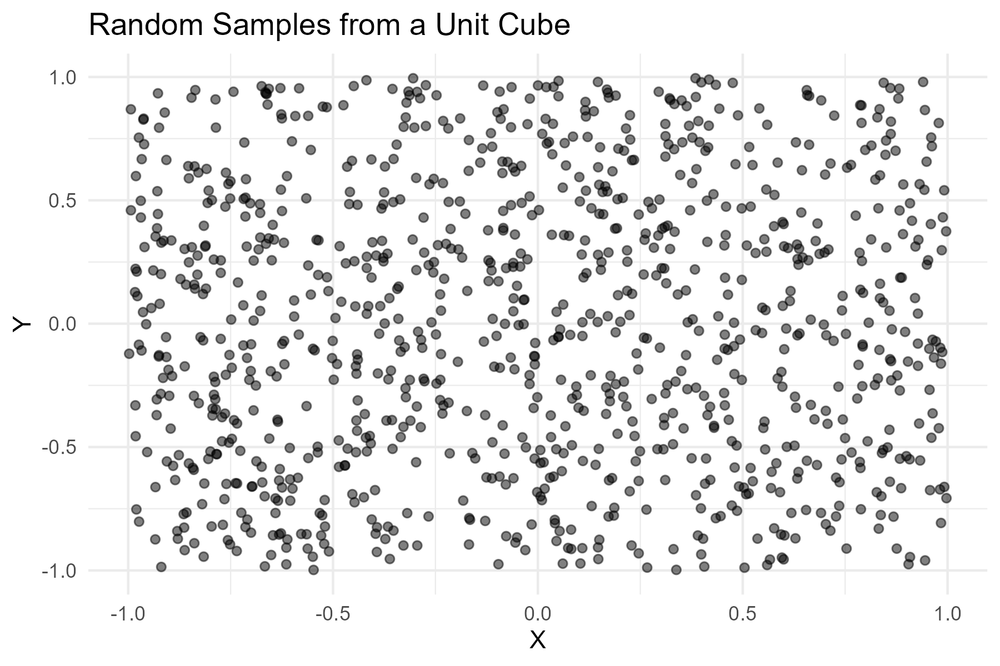
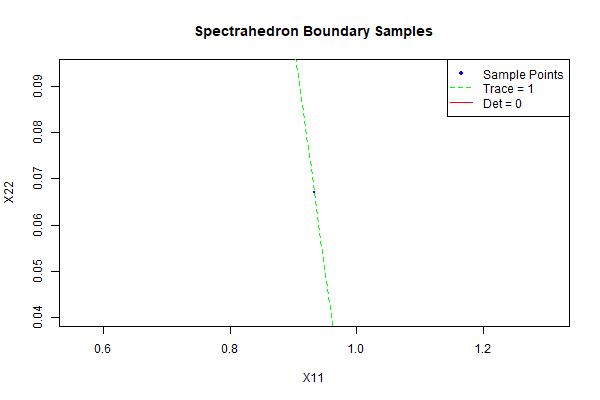

<p align="center"></p>

**VolEsti** is a `C++` library for volume approximation and sampling of convex bodies (*e.g.* polytopes) with an `R`  interface. For a limited `Python` interface we refer to package [dingo](https://github.com/GeomScale/dingo). **VolEsti** is part of the [GeomScale](https://geomscale.github.io) project.

[](https://cran.r-project.org/package=volesti)
[](https://cran.r-project.org/package=volesti)

[](https://volesti.readthedocs.io/en/latest/?badge=latest)
[](https://gitter.im/GeomScale/community?utm_source=share-link&utm_medium=link&utm_campaign=share-link)

### 🧪 Test results

[](https://cran.r-project.org/web/checks/check_results_volesti.html)
[](https://github.com/GeomScale/volesti/actions/workflows/cmake-gcc.yml?query=branch%3Adevelop)
[](https://github.com/GeomScale/volesti/actions/workflows/cmake-clang.yml?query=branch%3Adevelop)
[](https://codecov.io/gh/GeomScale/volesti)
[](https://github.com/GeomScale/volesti/actions/workflows/docs.yml?query=branch%3Adevelop)

[](https://github.com/GeomScale/volesti/actions?query=workflow%3AR-CMD-ubuntu)
[](https://github.com/GeomScale/volesti/actions?query=workflow%3AR-CMD-macOS)
[](https://github.com/GeomScale/volesti/actions?query=workflow%3AR-CMD-windows)

### 📄 Documentation

* [Package documentation](https://volesti.readthedocs.io)
* [Wikipage with Tutorials and Demos](https://github.com/GeomScale/volesti/wiki)
* [Tutorial given to PyData meetup](https://vissarion.github.io/tutorials/volesti_tutorial_pydata.html)
* [Tutorial on (truncated) logconcave sampling (R and C++)](https://papachristoumarios.github.io/2020/07/21/Sampling-from-high-dimensional-truncated-log-concave-densities-with-volesti)
* [Contributing](CONTRIBUTING.md)

### ⭐ Credits

* [Contributors and Package History](doc/credits.md)
* [List of Publications](doc/publications.md)

### © Copyright and Licensing

Copyright (c) 2012-2024 Vissarion Fisikopoulos\
Copyright (c) 2018-2024 Apostolos Chalkis\
Copyright (c) 2020-2024 Elias Tsigaridas

You may redistribute or modify the software under the [GNU Lesser General Public License](/LICENSE) as published by Free Software Foundation, either version 3 of the License, or (at your option) any later version. It is distributed in the hope that it will be useful, but WITHOUT ANY WARRANTY.

# Geometric Sampling and Optimization

This repository contains three implementations for geometric sampling and optimization:

1.  **Volesti Sampling Demo**: Basic polytope sampling using the `volesti` package.
2.  **Spectrahedron Boundary Sampling**: Hit-and-run sampling from the boundary of a simple 2x2 spectrahedron.
3.  **Interior Point Method for Linear Programming**: A primal-dual path-following algorithm for solving LPs in standard form.

## Prerequisites

Ensure you have R installed. Then, install the required packages:

```R
install.packages(c("volesti", "Matrix", "ggplot2"), repos="https://cloud.r-project.org")
```

## Running the Examples

To run all examples and generate the output plots and terminal results:

```bash
Rscript run_all.R
```

Alternatively, run individual examples from the `examples/` directory in RStudio or via `Rscript`.

## Results

The `run_all.R` script produces the following output files and terminal results:

### 1. Volesti Sampling Demo (`examples/test_volesti.R`)

Generates random samples from a unit cube and visualizes the first two dimensions.

**Output Plot (`volesti_samples.png`):**



### 2. Spectrahedron Boundary Sampling (`examples/simple_spectrahedron.R`)

Generates samples from the boundary of a 2x2 spectrahedron defined by `trace(X) = 1` and `det(X) >= 0` (with off-diagonals fixed at 0.25).

**Output Plot (`spectrahedron_boundary.png`):**



**Terminal Output:**
```
Mean trace: 1
Mean off-diagonal: 0.25
Mean determinant: 2.775558e-17
```

### 3. Interior Point Method (`examples/interior_point_lp.R`)

Solves the following linear program:
```
minimize    -x1 - x2
subject to   x1 + x2 + s1      = 2
             x1 - x2      + s2 = 1
             x1, x2, s1, s2 >= 0
```

**Terminal Output:**
```
Testing interior point method...

Solving sample problem:
minimize    -x1 - x2
subject to   x1 + x2 <= 2
             x1 - x2 <= 1
             x1, x2 >= 0

Finding initial point...
Iteration 10: duality gap = 4.27e-08
Converged after 11 iterations

Results:
Status: optimal
Objective value: -2.096023e-13
Solution (first two components are x1, x2):
[1] 0 0
Duality gap: 1.994833e-09
Iterations: 11

Constraint verification:
x1 + x2 = 2.096023e-13 (<= 2)
x1 - x2 = -2.096023e-13 (<= 1)
x1, x2 >= 0: TRUE
```

## Repository Structure
```
.
├── examples/
│   ├── test_volesti.R         # Basic volesti demo
│   ├── simple_spectrahedron.R # Boundary sampling
│   └── interior_point_lp.R    # LP solver
├── volesti_samples.png        # Output plot from test_volesti.R
├── spectrahedron_boundary.png # Output plot from simple_spectrahedron.R
├── run_all.R                  # Script to run all examples
└── README.md                  # This file
```
